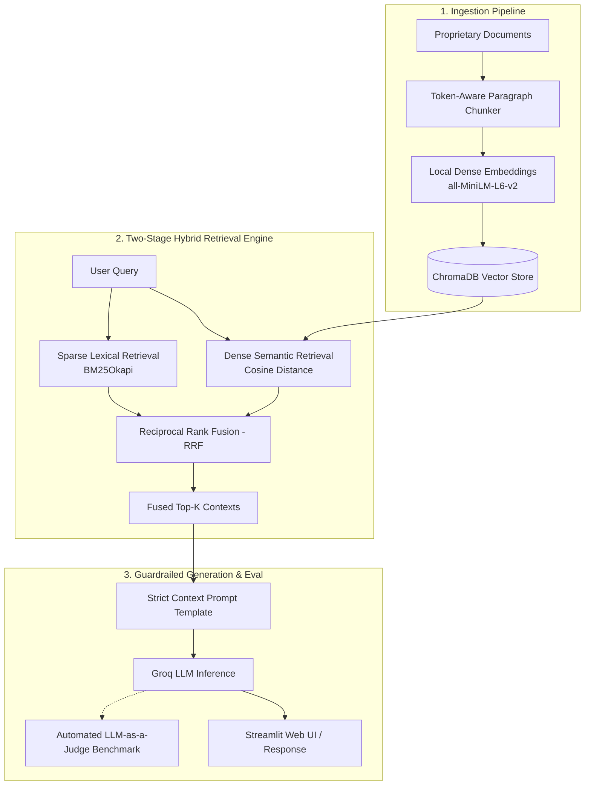

# Enterprise RAG Engine (Built from Scratch)

[](https://www.python.org/)
[](https://www.trychroma.com/)
[](https://groq.com/)
[-red.svg)]()

A modular, production-grade Retrieval-Augmented Generation (RAG) system engineered **entirely from foundational libraries** (`tiktoken`, `sentence-transformers`, `chromadb`, `rank-bm25`, and raw API clients). 

This repository intentionally foregoes high-level wrappers like LangChain or LlamaIndex to deliver complete visibility into token budgeting, custom chunking boundaries, hybrid rank fusion, and automated LLM-as-a-Judge evaluation.

---

## 🏗️ System Architecture



---

## 🌟 Architectural Highlights

### 1. Token-Aware Semantic Paragraph Chunker (`ingest_01.py`)

* Standard fixed-character chunkers indiscriminately slice through sentences and clauses, degrading dense semantic representation.
* This implementation parses natural paragraph delimiters (`\n\s*\n`) while continuously tracking cumulative token counts with `tiktoken`. Sentences remain unbroken, preserving complete operational context per vector.

### 2. Dual-Engine Hybrid Search & Reciprocal Rank Fusion (`query_hybrid.py`)

* **Dense Retrieval (`sentence-transformers/all-MiniLM-L6-v2`):** Captures conceptual intent and semantic synonyms.
* **Sparse Retrieval (`BM25Okapi`):** Guarantees high precision for exact regulatory IDs, statutory timelines, and acronyms (e.g., *GDPR*, *SOC 2*, *TLS 1.3*, *AES-256*).
* **Reciprocal Rank Fusion (RRF):** Instead of attempting fragile cross-algorithm score normalization, ranks are aggregated via:
$$\text{RRF Score}(d) = \sum_{m \in M} \frac{1}{k + r_m(d)}$$


*(with smoothing parameter $k = 60$)*, eliminating score dominance from outlier vector distances or term frequencies.

### 3. Automated LLM-as-a-Judge Benchmark (`evaluate_03.py`)

* Evaluates the pipeline end-to-end against a synthetic compliance dataset without requiring human annotation.
* Quantifies **Retrieval Hit Rate**, **Faithfulness** (absence of hallucinated assertions), and **Answer Relevancy**.

### 4. Interactive Enterprise Dashboard (`app.py`)

* Built with Streamlit, featuring an architectural comparison toggle (`Dense Only` vs `Hybrid Search`) and an expander to inspect the raw context chunks feeding the generator.

---

## 📊 Evaluation & Benchmark Results

The pipeline was benchmarked against a custom golden test dataset across four distinct compliance categories:

| Evaluation Category | Retrieval Precision | Faithfulness | Answer Relevancy | Behavioral Verdict |
| --- | --- | --- | --- | --- |
| **Factual Extraction** | 1.0 | 1.0 | 1.0 | Accurate statutory recall (€20M / 4% global turnover) |
| **Strict Numeric Rule** | 1.0 | 1.0 | 1.0 | Exact reporting window identification (72 hours) |
| **Negative Constraint** | 1.0 | 1.0 | 1.0 | Successfully catches non-granted rights under SOC 2 |
| **Out-of-Scope (Trick Prompt)** | 1.0 | 1.0 | 0.0* | **Zero Hallucination:** Explicit refusal to fabricate data |

> ***Architectural Trade-off (Faithfulness vs Relevancy):**
> On out-of-scope prompts (e.g., asking about HIPAA penalties on a GDPR/SOC 2 dataset), the model receives an intentional `0.0` on semantic relevancy because it does not answer the user's literal inquiry. However, it achieves a perfect `1.0` on Faithfulness by strictly adhering to guardrails and replying: *"I cannot find the answer in the provided documents."* In mission-critical legal/compliance RAG systems, **refusing to hallucinate takes precedence over attempting an answer.**

---

## 📁 Repository Structure

```text
├── data/
│   └── compliance_handbook.txt    # Synthetic enterprise compliance operations manual
├── src/
│   ├── ingest_01.py               # Token-aware chunking & ChromaDB vector ingestion
│   ├── query_02.py                # Dense vector retrieval pipeline
│   ├── query_hybrid.py            # Hybrid search pipeline (Dense + BM25 + RRF)
│   ├── evaluate_03.py             # Automated LLM-as-a-Judge benchmark suite
│   └── app.py                     # Streamlit web application with search mode toggle
├── .gitignore                     # Excludes .venv, .env, and local database stores
├── requirements.txt               # Locked dependencies
└── README.md                      # Project documentation

```

---

## 🚀 Getting Started

### 1. Prerequisites

* Python 3.10+
* Free [Groq Cloud Account](https://console.groq.com) for ultra-low latency LLM inference.

### 2. Installation

Clone the repository and install project dependencies inside a virtual environment:

```bash
# Clone the repository
git clone [https://github.com/](https://github.com/)<your-username>/enterprise-rag-from-scratch.git
cd enterprise-rag-from-scratch

# Create and activate virtual environment
python -m venv .venv

# On Windows (PowerShell):
.\.venv\Scripts\activate
# On macOS/Linux:
source .venv/bin/activate

# Install dependencies
pip install -r requirements.txt

```

### 3. Configure API Credentials

Create a `.env` file in the root directory:

```bash
GROQ_API_KEY="gsk_your_groq_api_key_here"

```

### 4. Run the Pipeline

**Step 1: Chunk and Ingest Data**

```bash
python src/ingest_01.py

```

*Processes the source documents, generates embeddings locally using `all-MiniLM-L6-v2`, and establishes the persistent ChromaDB index.*

**Step 2: Run the Automated Benchmark**

```bash
python src/evaluate_03.py

```

*Executes the golden test suite and prints the automated evaluation scorecard directly to the terminal.*

**Step 3: Launch the Streamlit Web UI**

```bash
streamlit run src/app.py

```

*Launches the browser dashboard with live retrieval toggle controls and context inspection tools.*

---

## 🛡️ Production Hardening & Scalability Roadmap

To scale this architecture from thousands of documents to tens of millions across multi-tenant enterprise environments:

1. **Distributed Vector Storage:** Transition from local, file-based ChromaDB instances to clustered vector search infrastructure (e.g., Qdrant, Milvus, or Pinecone) backed by pre-filtering on document metadata (e.g., `tenant_id`, `access_tier`, `department`).
2. **Cross-Encoder Re-ranking:** Introduce a secondary re-ranking stage (e.g., `bge-reranker-large` or Cohere Rerank) over the fused top-20 candidates prior to context window packing.
3. **Contextual Compression & Selective Attention:** Implement dynamic context summarization to prune non-essential sentences before LLM ingestion, reducing time-to-first-token (TTFT) and inference compute.

```

```